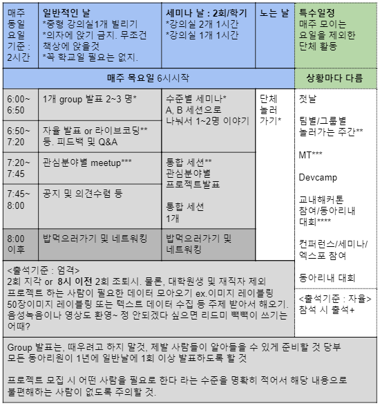

# Curriculum

 

## I Team 
1학기 필수 : 혼자 공부하는 머신러닝+딥러닝 
  - 컨퍼런스 콜 매주 진행
  - 컨퍼런스 콜 맡은 팀이 퀴즈 및 과제를 만들어서 제시 / 매주 정해진 요일까지 과재해서 깃헙에 업로드
  - 주제에 맞는 실습 (예정)
  
2학기 필수 : 케라스 창시자에게 배우는 딥러닝 스터디 및 컨퍼런스콜 & 팀 프로젝트
 

## A Team 
1학기 완료 : 각 분야 스터디 및 컨퍼런스콜 (팀별로)
  - CV : 7개의 논문 리뷰 완료
    - ResNet, UNet, DeepLabV3+, Faster R-CNN, YOLOV3, Focal Loss for Dense Object Detection, Mask R-CNN
  - NLP : 위키독스 '딥러닝으 이용한 자연어처리 입문' 스터디, 텍스트 기반 향수 추천 프로젝트
  - ML : 머신러닝 이론 스터디 및 매주 컨퍼런스콜 진행
 
2학기  : 프로젝트 (+프로젝트 논문), 논문 작성, 또는 스터디

  
 

### 철학
> 1년동안 모임의 우여곡절을 마주치면서, 사람들의 needs 가 모두 다르다는 것을 많이 느꼈습니다. 원하는 공부량과 동아리로부터 얻어가고자 하는 것, 공부하고자 하는 것이 모두 달랐습니다. 관심분야별로 그리고 실력별로 최대한 세분화하여 운영하는 것이 좋겠다는 생각이 들었습니다. 누군가는 스터디를 누군가는 프로젝트를, 누군가는 머신러닝을 누군가는 자연어처리를, 즉 - '원하는 것과 관심있는 것이 다르면 함께하기 어렵다' 라는 생각을 존중하고 싶습니다. 관심없는 것은 공부 안 하고, 관심있는 것은 편하게 구경갈 수 있는 분위기라면 좋겠습니다.  

> 실력이 뛰어나신 분들이 관심을 가지시는 분들께 편하게 이야기해 주고, 배우고 싶은 사람들이 쉽게 뛰어나신 분들께 찾아갈 수 있는 환경이면 좋겠습니다.  

> 1학기정도 대규모로 운영한 결과 특정 분야 (특히, CV/DA) 에 인원 몰림 현상이 발생했고, 몇몇 분야 (특히, RL/DSP/NLP) 은 사람이 없어 같이할 사람이 부족한 현상이 종종 나타날 수 있음을, 이는 비단 우리학교만의 문제가 아닌 것으로 확인했습니다. 이러한 현상이 나타날 수 있다는 것은 충분히 이해하나, 소수 분야 (RL/DSP/NLP) 를 하실 분들은 어느정도 양해를 부탁드리고, '와 40명규모의 인공지능 동아리에도 이쪽이 이렇게 없는데 어딜 가든 뭐 있겠어' 라고 생각해 주신다면 정말 감사하겠습니다.  

 

## 명예의 전당 (deprecated)

- 이 회원들은 아래 조건을 모두 충족함에 따라 메인 README.md 에 게시되고, SAI Repo 에 접근할 권한을 부여합니다.
- *코로나 등의 특수한 상황을 고려해서, 유동적으로 반영할 예정입니다.*
- 저희가 아는 한, 최대한 업로드를 해드리지만 그렇지 못하다는 점 이해 부탁드리고, 업로드를 원하시는 경우 운영진에게 제발!! 편하게!! 이야기해주세요.

 

**1학기 이상 정기적 전체모임에 참여할 수 있는 사람의 경우**  
- 그룹 스터디 1개 이상 참가
- 한 학기간 일반날/세미나날/노는날 무단결석 0 회
- 한 학기간 일반날/세미나날/노는날 공지결석 1 회 이하 (구제조건 포함)
- 그룹스터디 발표 1년간 1회 이상
- 세미나 발표 1년간 1회 이상
- 프로젝트 / 전교생대상 세미나 및 전교생 이상 규모 발표 / 대외활동 1회 이상 참가
- 1학기 I 팀 : 1년간 교내외 해커톤 및 대회 장려상 이상 1회 이상 수상 또는 그에 준하는 프로젝트/성과
- 1학기 A, S팀 : 1년간 교내외 해커톤 및 대회 은상 이상 1회 이상 수상 또는 그에 준하는 프로젝트/성과

 

**1년간 정기적 전체모임에 참여할 수 없는 사람의 경우**  
- 그룹 스터디 1개 이상 참가
- 그룹 스터디 1개 이상 개설
- 특수일정 3회 이상 참가 (연간 특수이렁이 3개 미만인 경우 전체 참가)
- 프로젝트 / 전교생대상 세미나 및 전교생 이상 규모 발표 / 대외활동 2회 이상 참가
- 1학기 I 팀 : 1년간 교내외 해커톤 및 대회 장려상 이상 1회 이상 수상 또는 그에 준하는 프로젝트/성과
- 1학기 A, S팀 : 1년간 교내외 해커톤 및 대회 은상 이상 1회 이상 수상 또는 그에 준하는 프로젝트/성과

 

**재직자/대학원생의 경우**  
- 그룹 스터디 1개 이상 참가
- 그룹 스터디 1개 이상 개설 또는 1개 이상 팀 멘토링
- 인공지능을 활용한 주제의 전국단위 규모 대회 1회 이상 입상 또는 그에 준하는 프로젝트/성과 또는
- 인공지능 주제 재직 / 인공지능 관련 연구 + SAI 에서의 일정 수준 이상의 교류

 

**기타**  
- 1년 이상 운영진활동
- 각 Conference Call Lead
- 및 재정적 후원

  

# 2. Part - 만나는 횟수와 만나는 시간에 대하여

 

## 동아리 단체활동
### 연합동아리 활동
- Deepuser : 대학머신러닝동아리연합 세미나, Devcamp 등 (예정)

 

### 대회 참여
- 2주에 1번 팀원모집 투표를 올리고, 알아서 관심분야 맞는 사람과 참여하세요.
- 다른 교내 개발 동아리나 창업 동아리 등과 인적 자원 교류 (계획)

 

### MT아닌 MT 및 교류활동
- 술냄새 안나는 MT 1 : 기간 미정, 아마도 세미나 2회정도 지난 후 중간고사 끝나고, 서울에서 즐기는 보겜카 및 방탈출 등 컨텐츠, 술 안먹는 사람들도 라이트하게 즐길 수 있는 칵테일바
- MT 2 : 날씨 좋은 날, 여름방학 이후 개강한 지 1주일 이내, 대성리같이 하찮게 술냄새나는 MT촌따위는 절대 안 감 무조건 에어비앤비로 가자!
- MT 3 : 종강 직후 또는 직전에, 스키장이나 스파 가자!
- 1달 1회 이상 나들이 및 회식

 
비고 - season1, season2 나들이 : 어린이대공원 테마파크 및 게임장, 상금으로 건대 애슐리 FLEX 이후 게임장 및 코인노래방, 방탈출카페, 깍뚝 5회, 롤 자유랭겜

 

### 철학
> 대성리가 질리고 술이 싫은 사람도 있으니까요.

 

## 동아리 전체 정기모임 (코로나 거리두기 단계 1단계시 합니다!)
### 횟수
- 1주일 1회 이상에서 자율
- 시험주, 그 전주 제외

 

### 시간
- 운영진이 가장 많이 참석할 수 있는 날을 중심으로 회의를 통해 민주적으로 결정, 1년동안 유효
- 1시간 30분 이상

 

### 컨텐츠
- 세션별 세미나
- 그룹별 발표
- 수준별이 아닌 관심 분야별 meetup
- 생각 교류
- 다양한 컨텐츠
- 학교차원 발표
- 공지 및 의견수렴 등

 

## 자신이 속해 있는 팀 정기모임
### 횟수
- 1주일 1회 이상에서 자율
- 2주에 1회 온라인 또한 만나는 것으로 인정
- 시험주, 그 전주 제외

 

### 시간
- 팀원의 의견을 반영해서 민주적으로 결정
- 학술적으로 가지는 시간 1시간 30분 이상
- 사진으로 학술적 모임 종료 인증할 것

 

### 컨텐츠
- 팀별 자율

 

### 도전들
- 제안1 : 유튜브에 각자의 세미나 자료를 비공개 링크 업로드, 서로 무엇을 하는지 공유
- 제안2 : 학교 학생들 대상으로 세미나를 준비
- 제안3 : 강화학습 알고리즘을 올릴 수 있는 게임환경을 만들어서 동아리 사람들 사이에서 에이전트 시합

 

### 철학
> 각 그룹과 팀이 제각각 모이는 것도 중요하지만, 전체가 모이는 시간 또한 중요하다고 생각합니다. 단순한 스터디가 아니면서 사람들과 충분한 친분과 교류를 만들고자, 자신이 속한 팀과 동아리 전체의 모임시간은 별개여야 한다고 생각했습니다.
> 어느 정도의 강제성이 존재해야, 애정을 쏟는 사람이 많을 것이라는 생각이 듭니다.

 

### 정기모임 상세 표로 보기

 

**일반적인 날 : 의자에 앉기 금지! 편안하게 배운 것을 복습하고, 서로 점검해주는 편한 분위기.**  

> group 발표 (2개~3개) : 그룹별로 알아서 발표자를 선택하고, 시간을 분배하면 됨. 스터디를 하는 단위를 그룹이라고 함. 한 학기에 적어도 모든 동아리원이 자신이 공부한 내용이나, 포괄적인 내용을 한번씩 발표를 할 수 있도록 하기 위함. 발표 형식은 정해진 것이 없음.  

> 자율 발표 (1개) : 프로젝트 발표를 해도 좋고, 되도록이면 S-A-I 수준을 막론하고 이야기하면 좋을 도메인 내용도 괜찮음. ex) 건축과 딥러닝 with 배현진. 라이브코딩도 모두가 다같이 해볼 수 있는 내용이면 좋을 듯.  

> 평소 스터디는 수준별로 묶일 가능성이 큼. 하지만 그것뿐 아니라, 자신이 관심가는 분야의 사람들과 이야기하고, 해보고 싶은 프로젝트를 이야기하거나 더욱 해보고 싶은 스터디를 제안하며 보내는 시간 또한 필요하다고 생각함.  

 

**세미나 날 : 평소발표보다 조금 더 배울 것이 많은 시간. 조금 더 많이 준비하고 발표해야 함. 그만큼 1학기에 2번만 오픈하여 부담을 조금 덜고자 함.**  

> 수준별 세미나 : 수준별로 들을 만한 컨텐츠를 마련하기 위해 두 가지 세션으로 나누어서 세션A 에서 2개의 발표, 세션B 에서 2개의 발표를 진행. 

> 통합 세션 : 그리고 모두가 다같이 들을 수 있을 만한 발표. 관심 분야별로, 프로젝트를 하고 있는 사람은 어떤 프로젝트를 하고 있는지 등을 발표하고 구경하는 시간을 가짐.  

**노는 날 / 특수일정 : 친목과 네트워킹을 위해서 할당된 시간. 학교 밖으로 나가 보자는 취지.**  
> 동아리가 싹다같이! 술안마셔도되니까요. 같이 밥도 자주 먹으러 가서 얘기도 많이 하고 합시다.  
> 팀별로/그룹별로 해당 주에 놀러갈 시간 자율적으로 정하고, 참석 인증하면 됨.  
> 말씀드린 대로 우리는 숙소 잡을 때 대성리따위 가지 않음. 좀 더 내더라도 더 좋게 놀자.  
> 대회컨텐츠 : 준비 중, 2학기때  

 

- 최신 내용은 [운영진 회의록](https://docs.google.com/document/d/1_4STUHcHD14tZ1z3DoDl4c6zF7IrX97CL1AjtGY60MQ/edit?usp=sharing) 에서 볼 수 있습니다.
- 댓글 권한 열려 있으니 많은 의견 제시 부탁드립니다.

 
 

# 4. Part - 활동 규칙

 

- 활동기간은 1년을 원칙으로 함.
- 하지만 특수한 사정이 있거나, 1학기 활동 후 입대/교환학생 등의 경우,  
  그것을 고려해서라도 함께할 가치가 있다고 여겨지면 함께하도록 함.

 

## 결석 기준

- 처음에 한 학기간 정기모임 해당 요일 불가능하다고 하신 분, 졸업생, 대학원생은 출석기준에서 제외 
- 3회 무단 결석 : ban
- 2회 공지 후 결석 : 1회 무단 결석과 동일
- 동아리 특수 활동 참여시 1회 공지결석 면제
- 프로젝트 1개 참여 완료 시 1회 공지결석 면제
*코로나19 등 특수한 상황이 겹칠 경우, 운영진이 유동적으로 조절*  

 

## 지각/조퇴 기준

- 정기적으로 만나는 요일이 정해진 단체 활동 2회 지각/ 지정 시간외 2회 조퇴
- 2회 지각 또는 2회 조퇴 시, 컴퓨터와 동아리 친구들에게 봉사하는 라벨링 노동이 기다릴 것임.

 

## 팀별 출결 기준

- 팀 내에서 자유롭게 정하기

 

## 발표

- 팀별로 정하기, 1인당 최소 2~3회 권장

 
 

# 5. Part - 연간 일정, 기억해야 할 것, 해야할 것

*Remind : S팀, A팀, I팀 각각에 '그룹' 이 존재하는 것입니다! 팀과 그룹이 헷갈릴까 말씀드립니다*  

그룹마다 repository 를 개설해서 아래 내용을 학습한 자료 및 개요를 업로드합니다. 
- 그룹장 : README.md 날짜, 시간, 참가자, 다음 주 계획(날짜, 시간, 참가자, 학습목표 등..), 다음주 장소예약/공지*
- 그룹원 : README.md 학습한 자료, 자신이 공부한 내용의 대략적인 내용, 발표 자료가 있다면 업로드

*장소예약은 세종대학교 장소예약시스템을 이용하거나, 스터디룸도 괜찮고, 꼭 어떤 학습의 환경이 아니어도 괜찮습니다.  
*어린이대공원에서도 했는데요 뭘

 

팀마다 활동 사진을 촬영하여 전체 카톡방에 업로드합니다. (학습 인증, 출석 확인 목적)  
참석자가 드러나도록 사진을 촬영해서 전체톡방에 업로드해주세요.

 

그룹별 스터디는 그룹 내에서 + 그룹장들이 자율적으로 판단하여 해 주시면 됩니다.  

 

자율적으로 목표와 스터디내용을 기록하는 우수사례  
- [2020 I Team Group 1, (그룹장 이현동) Notion Link]()

 

# 7. Part - Other Contents

- 행아웃. 다같이 화면 공유해놓고 스터디 하세요.

 
 

# 6. Part - 학습 소스

동영상 학습 소스들은 SAI youtube 에 재생목록을 만들어 둘 예정입니다.  
https://www.youtube.com/channel/UCMf5F1uTcuz8MPN62kb55cg/playlists?view_as=subscriber

 
 

- I 수준 : [모두를 위한 딥러닝 / 한국어영상 / 1달↑](https://www.youtube.com/playlist?list=PLlMkM4tgfjnLSOjrEJN31gZATbcj_MpUm)  
  홍콩과기대 김성훈 교수님이 제작하신 머신러닝과 인공지능 전반의 바이블입니다.  
  Season 2 가 나왔지만, AI 프레임워크 실습이 아닌 이론에 집중하고 싶다면 Season 1 을 추천합니다. 
  
- A1 수준 DL : [Neural Networks and Deep Learning / 영어영상, 한글자막 / 1주일↑](https://www.youtube.com/watch?v=CS4cs9xVecg&list=PLkDaE6sCZn6Ec-XTbcX1uRg2_u4xOEky0)  
  이제 갓 인공지능이 무엇인지 익숙해진 분들이 프로젝트를 해 볼 때 한번쯤 부딪히는 용어들을 짚고 넘어가는 등, Neural Network 에 대하여 굉장히 포괄적인 내용을 전해 주는 강의입니다.
  
- A2 수준 CV : [Convolutional Neural Networks / 영어영상, 한글자막 / 1주일↑](https://www.youtube.com/watch?v=ArPaAX_PhIs&list=PLkDaE6sCZn6Gl29AoE31iwdVwSG-KnDzF)  
  Neural Network 에 익숙해지고, Computer Vision 에 관심이 있거나, 이미 Computer Vision 을 어느정도 알고 있는데 한번 더 다져보고 싶다 할 때 듣기 좋은 강의라고 생각합니다.

- A2 수준 RL : [Pang-Yo-Lab 강화학습 기초이론 / 한글영상 / 1달](https://www.youtube.com/watch?v=wYgyiCEkwC8&list=PLpRS2w0xWHTcTZyyX8LMmtbcMXpd3s4TU)  
  알파고의 아버지 David Silver (Google Deepmind 소속) 교수님의 강의를 한글로 풀어 설명합니다. 그만큼 묵직한 내용으로 정말 많은 내용을 담고 있는 강의입니다. 찬찬히 따라가면 이해는 할 수 있으나 시간이 상당히 걸립니다.
  
- A3 수준 CV : [Stanford CS231N: CV with Deep Learning | Spring 2017 / 영어영상, 영어자막 / 1달↑](https://www.youtube.com/watch?v=vT1JzLTH4G4&list=PLC1qU-LWwrF64f4QKQT-Vg5Wr4qEE1Zxk)  
  Computer Vision 에 관심이 있다면, Stanford University 의 Fei-Fei Li 교수님이 2017년 제작한 심화 CV 강의의 바이블 영상을 들어 보세요.
  
- A3 수준 NLP : [Stanford CS224N: NLP with Deep Learning | Winter 2019 / 영어영상, 영어자막 / 1달↑](https://www.youtube.com/watch?v=8rXD5-xhemo&list=PLoROMvodv4rOhcuXMZkNm7j3fVwBBY42z)  
  CV 에 CS231n 이 있다면, NLP 에는 CS224n 이 있습니다.

- A3 수준 NLP : [Stanford CS224N: NLP with Deep Learning | Winter 2019 / 영어영상, 영어자막 / 1달↑](https://blog.naver.com/laonple/220463627091?proxyReferer=https%3A%2F%2Fblog.naver.com%2FPostView.nhn%3FblogId%3Dlaonple%26logNo%3D220836305907%26proxyReferer%3Dhttps%253A%252F%252Fwww.google.com%252F
)  
  CV 에 CS231n 이 있다면, NLP 에는 CS224n 이 있습니다.

- A3, S 수준 : [fast.ai : Making neural nets uncool again](https://www.fast.ai/)  
  아직 제가 활용해본적은 없으나, 코드와 함께 구현해보고 싶다면 이 사이트를 활용하라고 마찬가지로 Terry 님이 추천해 주셨습니다.

- A2, A3, S 수준 : [Edwith : 논문으로 짚어보는 딥러닝의 맥 / 한국어영상 / 1달](https://www.edwith.org/deeplearningchoi/joinLectures/10979)  
  무료 학습 플랫폼 edwith 에서 최성준님이 진행하는 강의입니다. 쉬운 내용도 있고, 논문과 함께 보는 내용도 있어서 다양한 사람들이 종종 참고하기 괜챃을 것 같습니다.

- A3, S 수준 : [모두의 연구소, 그들은 밤에 무엇을 하는가 : Moducon](http://moducon.kr/2018/2018/12/06/kimhyunwoo-session/)  
  우리나라에서 가장 활발한 강화학습 민간연구소는 단연 모두의 연구소입니다.

- A,S 수준 : [python 심화 / 한국어 PPT / 1주일](https://www.slideshare.net/dahlmoon/indexingampslicing-20160510)  
  쉬워 보이는 python 도 까보면 어렵다! python 의 기본 기능을 넘어서 구조를 들여다보고싶은 분들에게 추천하는 슬라이드입니다.

- S 수준 DL/RL : [Deep Learning, RL Summber School / 영어](https://dlrlsummerschool.ca/past-years/)  
  Terry 님이 추천하신 학습 소스로, 다양한 분야의 특정 이슈를 공부하는 방식으로 진행됩니다.

- S 수준 : [최신 논문 조회 / 영어](https://paperswithcode.com/sota?fbclid=IwAR2Quk2s9VkTUdPl06wrZJiFdHXNzPPPFlv0EwMUfsjW7qQoarK_Tg1B8VE)  
  코드와 함께 업로드되는 분야별 최신 논문을 볼 수 있습니다.

 

*21세기에는, 특히 CS(Computer Science) 분야에서는 이렇게 좋은 무료 강의가 많다!*  
*좋은 강의가 있다면 얼마든지  업로드 부탁해요.*

 

### 다른 분야

- [Aurix Tutorial, 창원대학교 이우택 교수님](https://aurixtutorial.readthedocs.io/ko/latest/index.html)

 

# 3. Part - SAI youtube

 

유튜브는 최고의 선생님입니다. 아주 훌륭한 학습 자료들이 넘쳐나지요. 유튜브 계정 접근권한을 드립니다. 서로 보면 좋을 것 같은 자료를 재생목록에 추가하고 다른 친구들도 학습 자료를 볼 수 있게 해 봅시다.

 

재생 목록

### S level

| 재생목록 이름 | 취지 및 목적  |
|:--------------|:------------:|
| (S) RL      | 강화학습 |
| (S) CV      | 컴퓨터비전 |
| (S) NLP/DSP | 자연어처리/신호처리 |
| (S) DA      | 데이터분석 |

 

### A level

| 재생목록 이름 | 취지 및 목적  |
|:--------------|:------------:|
| (A) Math/LinearAlg Studysource |        수학 선형대수 학습자료      |
| (A) Math/Static Studysource    |        수학 확률통계 학습자료      |
| (A) Math/Other Studysource     |        수학 학습자료               |
| (A) ML                 |        Machine Learning, 인공신경망 방법론이 아닌 머신러닝 전반 1학점 수준의 교양      |
| (A) ML Studysource     |        Machine Learning, 인공신경망 방법론이 아닌 머신러닝 전반 학습 자료      |
| (A) RL                 |        Reinforcement Learning, 강화학습 1학점수준      |
| (A) RL Studysource     |        Reinforcement Learning, 강화학습 "학습 자료"      |
| (A) CV                 |        Computer Vision, 컴퓨터 시각 1학점수준      |
| (A) CV Studysource     |        Computer Vision, 컴퓨터 시각 "학습 자료"      |
| (A) NLP                |        Natural Language Processing, 자연어처리 1학점수준 교양      |
| (A) NLP Studysource    |        Natural Language Processing, 자연어처리 "학습 자료"         |
| (A) Project source     |        분야 전반 프로젝트에 대한 아이디어 |

 

### I level

| 재생목록 이름 | 취지 및 목적  |
|:--------------|:------------:|
| (I) AI Studysource     |        AI 전반 "학습 자료"            |
| (I) Project source     |        부담스럽지 않게 초심자도 할 수 있는 프로젝트 관련 아이디어 |
| (I) Python Studysource |        파이썬 자체의 학습 자료 |

 

### SAI handmaded

- S 팀 스터디 자료
- A 팀 스터디 자료
- I 팀 스터디 자료

> 원하는 경우, 또는 퀄리티가 좋은 경우 스터디자료 제공자에게 승낙을 받은 뒤 S,A,I level 의 공개자료의 재생목록에 추가

 
 

  
# 8. Part - 읽을거리

 

- [XAI(Explainable AI), 왜 주목하는가 (2019.12, 인공지능신문)](http://www.aitimes.kr/news/articleView.html?idxno=14859)  
- [논문 읽는 방법](http://gradschoolstory.net/terry/readingpapers/)  
- [백악관, 세계 최고 규모 코로나 데이터셋 오픈소스로 공개 (2020.3.22, 인공지능신문)](http://www.aitimes.kr/news/articleView.html?idxno=15726)  
- [GD 최적화 방법론들 정리](http://shuuki4.github.io/deep%20learning/2016/05/20/Gradient-Descent-Algorithm-Overview.html)
 
- [[딥러닝] 평생학습이란? (A Survey on Lifelong Learning)](https://realblack0.github.io/2020/03/22/lifelong-learning.html)
 

# 9. Part - 데이터셋

 

- 공개 데이터셋 백과  
  https://pathmind.com/kr/wiki/open-datasets
  
- 2018 가장 큰 자율주행 데이터셋 UC Berkeley BDD100K   
  https://sites.google.com/site/bimprinciple/in-the-news/gajangkeunopeunsoseujayuljuhaengchalyangdeiteosesgong-gae-ucberkeleybdd100k

 
 

자 이정도면 학습을 위한 환경은 어느정도 준비된 것 같고, 이제 하고싶은 것들을 마음껏 해보도록 합시다! *-장후-*  
