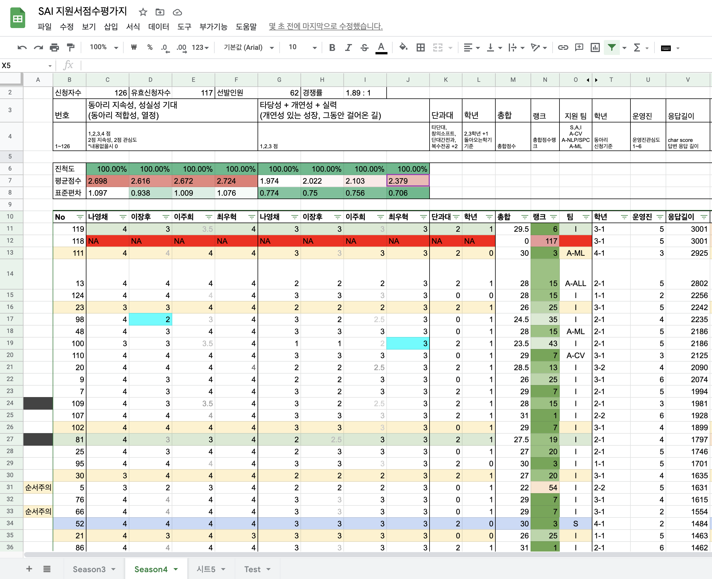

 

### PC 로 확인 부탁드립니다.

 

# Season4 점수기준

- 딩동~ 새벽에 문자 안녕~
- 많은 분들이 열심히 신청서를 작성해 주셨지만, 저희가 생각하던 인원 이상으로 너무 많은 분들이 관심을 가져주셔서 불가피하게 선발기준을 두게 되었습니다.
- 2020년 지원자 (60명) 의 두 배인 120명이 지원해 주셨습니다.
- 저희 스스로도 "체계가 잡히지 않은" 동아리라고 생각을 했지만, 저희 기준에 정말 많은 분들이 지원해 주신만큼 Season4 는 조금 더 부담감을 가지게 되는 것 같습니다.
- 지원자가 많아지면서 운영진 4명이 해당 기준에 맞추어 각자 채점하여 합산하였습니다.

 

| 동아리 지속성, 성실성 기대 (동아리 적합성, 열정) | 타당성 + 개연성 + 실력 (개연성 있는 성장, 그동안 걸어온 길) | 다른단과대 | 학년 |
|:-------------------------------:|:-------------------------------------------:|:----------:|:----:|
| Season 1\~3 운영진 2\~3명, 인당 0-4점 부여 | Season 1\~3 운영진 2\~3명,  인당 1~3점 부여| 타 단대 or 창의소프트 | 돌아오는 학기 2,3학년|
| 각 2점, 대부분 문항 무응답시 0점 | 학과, 걸어온 길 바탕으로 상대적으로 평가 | 2점 가산점 | 1점 가산점 |

 

*1학년, 4학년에 비해 동아리에 남아있을 수 있는 기간이 길다고 생각했기에, 2~3학년에 추가점수를 주게 되었습니다.*

  

# 인원

 

- google spreadsheet 로 설문을 옮겨 이름 colunm 을 삭제한 60명의 지원서를 4번씩 읽고 31명에게 긍정적 답변을 드렸습니다
- 불합격 안내를 드린 ? 명 중 ? 명이 추가적으로 지원했습니다.

  

# 평가상세 및 취지

 

- 2019년 초, 인공지능이라는 것 자체를 2학년 1학기의 몸으로 배우기 어려웠고, 접하기 어려웠던 제 (장후) 의 고통이 있었던 만큼, 최대한 많은 분께 접근성을 높여 주고 싶은 꿈이 있습니다.
- 못하는 건 전 혀 상관 없다고 생각합니다. 하지만, 다양한 환경 속에서도 자신이 해볼 수 있는 최소한의 시도를 해 본 분들이라고 생각이 들 수 없었던 분들은, 저희는 '능동적으로' '떠먹여주지 않아도 움직이는' 사람이라고 확신할 수 없었습니다.
- e.g. 1학년 1학기인데 고등학교에서 이런이런 활동을 했지만 저런 한계에 봉착하여, 여기에 지원을 했다는 경우
- e.g. 1학기인데 정말 많은 분야를 돌고 돌았지만 결국 여기가 관심사인 것 같아서, 여기에 지원을 했다는 경우
- 좋지 않은 예시로, SW 계열 2~3학년 1학기임에도 불구하고, "이제 해보려고 한다" 또는 "관심이 있었지만" "최소한의 공부를 해보려는 액션" 조차 없었던 분들에게 저는 좋지 않은 평가를 드릴 수밖에 없었습니다.
- 저희 운영진들은 항상 노력하지만, 직업이 아니기 때문에, 여러분들과 똑같이 모든 일을 할 수 없습니다. SAI 는 교육기관이 아닙니다. 스스로 하고 싶은 분야에 대해서 열정이 있어서, 자율적으로 스터디를 꾸리고 정해진 시간에 스스로 나오는 분들을 뽑아야 동아리가 돌아간다는 사실을 2020년 검증했기 때문에, 이런 기준을 두게 되었고 선발을 해서 운영하게 되었습니다. 
- 아무리 실제로 그런 생각을 가지고 계신 분들이어도, 정말 안타깝게도 그러한 모습이 지원서에 드러나지 않았을 경우 좋은 평가를 드리기 어려웠다는 점 양해 부탁드립니다.
- 비슷한 맥락에서, 다양한 도메인 (인문, 예술, 공학) 이 드러나게 서술해주신 분께 좋은 평가를 드렸습니다. 다른 분야에서, 이 분야에 관심을 가지기 위한 장벽이 높다고 판단했기 때문입니다.
- 더 자세히, 길게 작성해 주신 분이 "상대적으로 더 오래할 수 있고 더 열정이 있댜" 라고 절대적으로 판단하지는 않지만, 100자도 안되는 내용을 바탕으로 작성해주신 분들이 많았습니다. 
- 이런 경우, 어떤 분인지 파악하는 위험성이 더 높다고 생각해서, 내용이 짧은 분들은 상대적으로 점수가 낮을 수밖에 없었습니다.
- 우선 긴 문항들로 괴롭혀서 죄송하고, 서류 따위로 점수를 매겨서 정말 죄송합니다.
- 이 절차는 '관심도 열정도 시간도 별로 없는데 그냥 한 번 지원해 봤다' 라고 생각하여 분들을 최대한 줄이기 위한 작업이기에, 깊은 이해를 부탁드립니다.
- S팀의 경우 안내했던 대로 조기선발했습니다.

 

### 아래는 지원서에 대해 위 피드백을 적용한 예시입니다.

 

> 고등학교때 고등학교 생활기록부 채우기 위해서 마스터 알고리즘이라는 책을 읽었는데, 거기서 설명하는 딥러닝이 인공지능과 관련이 있는것 같아서 인공지능에 관심을 가지게 되었다. 인간이 배우는 방식을 연구하여 인공지능에 적용하려는 시도가 가장 흥미로웠던 것 같다.그리고 비슷한 걸 배우겠지 라는 심정으로 논술로 세종대학교 신설학과인 인공지능학과를 써 보았다. 사실 알고있는거라고는 미분해서 극대 극소 구하는 것 밖에 모르지만 동아리를 통해 앞으로 전공하게 될 분야를 대략적으로라도 파악하고 싶어서 지원한다.

- 1학년 1학기 지원자님의 답변입니다. 이런 응답이 1학년 응답이라면 "잘 할 필요는 없다" 의 동아리 마인드에 따라서는 부족함 없는 답변입니다. 하지만, "써 보았다." "알고있는 거라고는," 의 표현은, "최소한의 노력" 의 의지도 보이지 않을 뿐더러 학과와 학교 자체를 쉽게 여기고 있는 것 같네요. 무슨 마음인지는 알겠지만, 저희는 좋은 점수를 드리기 어려웠습니다.
- *저희 원칙 "공개의 원칙", 지원자의 발전과 SAI 발전을 위한 "상호 발전의 원칙" 에 따라서 내용을 공개합니다.*

 

> 그리고 길게 보자면 저는 컴퓨터 분야에 흥미가 있는데 생시부를 오게 된 가장 큰 이유이기도 한 단백질 구조 예측에 관심이 많습니다. 재수를 하며, 이미 대학을 간 친구들과 가끔 연락을 하며 지냈는데 그 중 한 친구가 생명공학과 입니다. 그 친구도 코딩 쪽에 실력과 흥미가 있는 친구였는데 생명공학과를 간 이유를 물어보니 생물정보학이라는 분야에 꿈이 있어 갔다고 얘기를 해줬습니다. <중략> 생명 기술에 컴퓨터 기술을 섞은 BIT 분야를 친구의 조언으로 여러가지를 찾아보며 단백질 구조 예측이란 기술을 알게 되었습니다. 이 분야가 단순한 구조 예측이 아닌 신약 개발 등에도 적용이 가능한 엄청난 기술이라는 것을 알게 되었습니다. 이게 제가 동아리, 학부 수준에서 할 수 있는 수준은 아니겠지만 이런 쪽을 계속 공부하고, 신약 개발에 일조해 여러 질병들을 고치고 싶습니다.

- 1학년 1학기 지원자님의 답변입니다. 현실성과 상관없이, 이렇게 관심을 가지게 된 계기를 제시해 주세요.
- *저희 원칙 "공개의 원칙", 지원자의 발전과 SAI 발전을 위한 "상호 발전의 원칙" 에 따라서 내용을 공개합니다.*

 

> C와 Java를 모두 독학으로 공부하고, 전공이 스마트기기공학이라 인공지능쪽에 대해서도 공부를 하고 싶은데 이제 막 2학년으로 올라가는지라, 대학에서 해당 강의를 수강하는데에는 제한적인 부분이 있어, 별도로 공부를 해보고 싶어 관심을 갖게 되었습니다. 

- 2학년 1학기 지원자님의 답변입니다. 언어 둘을 독학으로 공부했다는 것은 굉장히 대단한 일이고, 혼자 하기 어려운 일임에도 해내셨다는 것이 대단합니다.
- 하지만, 인공지능과 관련해서는 왜 관심이 서칭과 독학으로 이어지지 않았는지가 조금 궁금합니다.
- *저희 원칙 "공개의 원칙", 지원자의 발전과 SAI 발전을 위한 "상호 발전의 원칙" 에 따라서 내용을 공개합니다.*

 

> 지능기전공학부에 들어오기 전까지는 인공지능에 솔직히 관심이 별로 없었지만 과에서 공부를 하다보니까 내가 설계하는대로 실현되는 부분에 흥미를 느껴서 동아리까지 지원하게 됐습니다.

- 3학년 1학기 지원자님의 답변입니다. 어떤 부분에서 흥미를 느꼈는지 저도 공감합니다.
- 하지만, 3학년 1학기 지원자이고, "설계한 대로 실현된다" 라는 것을 말할 수 있을 정도면, 구체적인 사례정도는 말씀해주실 수 있지 않을까? 하는 생각이 들어 아쉬웠습니다.
- *저희 원칙 "공개의 원칙", 지원자의 발전과 SAI 발전을 위한 "상호 발전의 원칙" 에 따라서 내용을 공개합니다.*

 

> 혼자서 공부하다보니 이렇게 공부하는 것이 맞는건지 불안할 때가 정말 많았습니다. 또 학교에 아는 사람도 없어서 물어볼 사람도 없습니다. 물론 혼자서 공부할 것을 찾아서 하는 게 맞지만 누군가의 조언이 필요할 때도 많고, 같이 공부할 사람이 있었으면 좋겠다고 생각할 때가 많습니다. 제가 SAI에서 공부하고 싶은 것은 체계적인 머신러닝,딥러닝 공부입니다. 그리고 함께 Kaggle 랭킹도 올려보고 싶습니다. 이번방학에 기본 파이썬 지식을 바탕으로 파이썬을 더 공부하고, Numpy와 Pandas를 공부해서 Kaggle의 몇 가지 데이터를 가지고 혼자 분석을 해봤습니다. 그리고 ML도 혼자 공부하기 시작했는데 아직은 초보 수준이지만 책을 따라해보면서 익히고 있습니다. 하지만 따라하는 것은 공부가 아니라는 것을 알고 있습니다. 체계적이지도 않아서 공부하면서도 완전히 이해하고 있는건지, 제 것이 되고 있는건지 의문이 들 때가 많습니다. 응용을 해봐야 완전히 제 것이 된다고 생각하는데 혼자서 응용을 해보기가 많이 어렵습니다. 그래서 동아리 팀원들과, 미리 공부해보신 선배님들을 통해서 어떻게 공부해야할지 조언을 듣고싶기도 합니다. 

- 2학년 1학기 지원자님의 답변입니다.
- 시행착오가 담겨 있지 않나요?
- *저희 원칙 "공개의 원칙", 지원자의 발전과 SAI 발전을 위한 "상호 발전의 원칙" 에 따라서 내용을 공개합니다.*

 

### 그 외, 미래의 지원자분들과, 이번 지원자분들이 알아 주셨으면 하는 피드백입니다.

 

> 우선 파이썬 머신러닝 완벽 가이드라는 책의 예제를 혼자힘으로 다 풀어보고 싶다.후에 더 다양한 자료와 문제들을 풀어감으로써 차근차근 내가 연구할(정착할) 분야를 선택하고 싶다.

> 자료구조 알고리즘 스터디 진행해주세요!

- 위에서 말씀드렸듯이, SAI 는 교육기관이 아닙니다. 인공지능에 대해서 잘 할 필요는 없지만, 최소한 언어적인 내용은 스스로 해 주셔야 운영진이 다른 부분에 집중할 수 있습니다.
- 정말 안타까운 것 중 하나가, 전공자 2~3학년이 될때까지 심지어는 4학년이 될때까지 언어에 집착하시는 분들이 계십니다.
- 나 자신에게 "뭐 공부할까?" 를 물었을 때 C/python/java 와 같은 언어가 그 대답으로 나온다면, 아직 충분한 고민이 선행되지 않았다고 생각합니다. 언어는 도구일 뿐입니다.
- 비슷한 맥락에서 학교 교과목에 매달리는 분들이 계시는데, 기본이 나쁘다는 것이 절대 아니라 그건 스스로 하시거나 다른 스터디를 찾아보시는 것이 더 효율적일 것 같다는 생각이 들었습니다.
- 저희가 어느 의견도 괜찮다고 폼을 받았고 위 내용을 작성해 주신 것도 감사하지만, 이를 명시하는 것은 폼에 작성해주신 내용들이 시행되지 않았을 때에 대한 오해를 없애기 위해 미리 설명드립니다.
- *저희 원칙 "공개의 원칙", 지원자의 발전과SAI 발전을 위한 "상호 발전의 원칙" 에 따라서 내용을 공개합니다.*

 

> 아직 저의 실력이 좀 부족하기때문에 우선은 인공지능에 대해 더 배우는 것을 원하고 조금 숙련이 되었을 때 해커톤과 같은 교내 대회에 나가보고 싶습니다!

- 저도 항상 부족합니다. 하지만 제가 조금 더 믿는 부류의 자기소개서는 - 부족하더라도 대회에 나가보고, 나가서 부족함을 다시 깨닫고, 뭐가 필요한지를 알아서 공부하는 사람의 자기소개서입니다. 항상 부족하다고만 생각하면, 그것은 5년을 공부해도 10년을 공부해도 항상 부족함을 느끼게 된다고 생각해요. 적어도 그 도전 자체만으로도 그 사람의 관심이 증명되기 때문입니다.

 

### 재미있는 응답 몇 개

- Q. SAI 동아리 라이프! 동아리에 대해서 상상하는 것이 있다면? 무엇인가요? 예를 들면, 강화학습으로 만든 AI 로 서로 오목 둬보기 라던가. 스터디 끝나고 함께 치킨 먹으러 가서 프로젝트 이야기하기 라던가.. 어때요?
- A. 제 첫사랑 이루다가 없어졌어요ㅠㅠ 한 3단 너프된 버전이라도 좋으니까 같이 여자친구 만들어보시지 않을래요? -> *저도 딱 고3 끝나고 비슷한 경험이 있습니다. 유감이지만 지금은 있습니다.*
- A. 인공지능 공부를 하다가 일상이 인공지능으로 물들어 잘 때도 인공지능 꿈을 꿀만큼 동아리원분들과 열심히 공부하고싶습니다. 사실 공부도 중요하지만 좋은 인맥을 쌓는것도 동아리의 큰 장점이라고 생각하는데, 공부 끝나고 같이 밥을 먹는다든가, 가끔씩 놀러 가는 것도 좋다고 생각합니다 -> *WOW*
- A. 치킨 정말 좋아합니다. 맥주도요. 놀러가는것도 좋아합니다 차 끌고요. 그리고 김치찌개 기가막히게 잘 끓일줄압니다. -> *하.. 너무좋습니다.*

  

# 지원서 예시

 

- 공개 수락자에 한하여 게시
- 매우 긍정 예시, 커트라인 예시

 

### 공개목적

- 공정성, 투명성
- 명확한 기준 제시 및 서로 관심분야 파악하기

 

## 매우 긍정 예시

 

### 매우 긍정 Example 1

| 동아리 지속성, 성실성 기대 (동아리 적합성, 열정) | 타당성 + 개연성 + 실력 (개연성 있는 성장, 그동안 걸어온 길) | 다른단과대 | 학년 |
|:-------------------------------:|:-------------------------------------------:|:----------:|:----:|
| 4점, 4점, 4점, 4점 | 3점, 3점, 3점, 3점 | 자연과학대 | 2학년 | - |
| 16 | 12 | 2 | 1 | 31 |

 

### 프로그래밍/배경 지식

- python 에서 자료형 int, float, string 의 차이를 앎
- python 에서 리스트(list) 에 원소를 추가하거나 삭제할 줄 앎.
- python 에서 import 를 사용할 줄 앎.
- python 에서 내가 만든 python 파일을 import 해서 사용해봤음
- python 의 자료형들은 결국 class 들이라는 것을 앎.
- python 에서 numpy와 pandas를 사용해 본 적 있음.
- (언어무관) 객체지향과 Class의 개념에 대해서 알고 있음.
- (언어무관) 공식 document 를 읽으면서 코드를 작성해 본 적 있음.

 

### 단과대학, 학과, 학년

- 수학통계학부-응용통계학전공, 자연과학대
- 2학년 진행중, 

 

### 인공지능 자체에 관심가지게 된 계기가 무엇인가요?

 어떤 계기가 있었던 것은 아니지만 그냥 관심이 저절로 생겼던 것 같습니다. 4차 산업혁명시대니뭐니 하며 이곳 저곳에서 인공지능 타령을 해대니 관심이 없기도 힘들었습니다. 또한  "통계 전공으로써 인공지능은 통계를 가장 최고의 방법으로 활용하여 날개를 달아줄 것이라고 생각"한다고 어디서 많이 주워들었기 때문입니다.. 그래서 ' 그래 인공지능이 뭔데 그래?? '이런 엄청난 궁금증을 해소하고 싶어졌습니다.  관련 전공을 바탕으로 조금 찾아보는 노력을 해봤는데추론에 쓰이는 확률을 구현하기 위해 , 베이지안 추론을 배웠을적에  ..아 기계가 이렇게 데이터를 가지고 최선의 확률을 도출해내는 구나 싶었습니다 . (파이썬 matplotlib로 동전던지기 확률구하기 이런거만 하는 수준이지만 ,,, )도대체 의미있는 결과를 낼수있는,프로젝트를 해볼수가 없었습니다.  또한 수학적 확률이 통계적 확률로 근접하기 위해서는 대량의 데이터를 수집하여 하는데 , 대량의 데이터를 어떻게 얻을 것인지 몰라서 포기했습니다.
인공지능이 어떻게  추론능력,판단능력,자연어 이해,등등 을 구현할 수 있는가? 라는 질문은 머리꼭대기까지 올라와있는데 공부할 수 없다는점이 아쉬웠습니다. 이번 기회에 인공지능과 관련하여 많이 공부하여서 이런 궁금증들은 해소하면 좋을 것 같고 그렇기때문에 뭐 관심도는 지금 100%입니다!!!!!!!!!!!

 

### 동아리에 들어오면 하고 싶은 프로젝트 또는 내가 인공지능을 적용해서 해결해 보고 싶었던 문제가 있나요? 다른 사람들이 흔히 생각할 문제 말고, 내가 관심가지고 살던 분야에서 인공지능을 적용하고 싶었던 적이 있나요?

최근에 목소리ai를 본적이있습니다. 고 김광석가수님의 생전 목소리를 학습하여 다른 노래를 부르는 ai였는데 기계가 만들어낸 노래임에도 불구하고 울컥하였던 기억이 납니다.
인간의 발성구조와 노래의 음정을 합쳐서 구현하였다고 합니다. 저는 노래를 즐겨듣는데 요즘 들을노래가 없다는 생각을 많이합니다. 추천해주는 ai시스템도 취향저격을 시키지는 못합니다.따라서 내가 들은 노래를 바탕으로 추천 ai 와  내가 듣기 편한 목소리 ai를 접목시켜서 어떤노래에 가장 적합한 목소리를 입혀서 최고의 노래를 만들어주는 ai가 생기면 좋을것같습니다.
  
 
  
### 동아리에 들어오면 배우고 싶은 것이 무엇인가요? 어떤 공부를 함께하고 싶나요?
 
저는 동아리에 들어가면 배울것 투성이 일것같습니다..할 수있는것은 파이썬 numpy정도라서 
배워야 합니다.그래도 배워보고싶습니다.제가 전공공부에 알바에 녹초가 되더라도 시간을 쪼개서 인공지능을 공부해보고 싶습니다. 혼자가 아니라 여럿이 함께하는 공부이기에 더 의미있다고 생각합니다.강제성도 있고 책임감이 생기기떄문에 공부의 질이 달라진다고 생각합니다..
지금 개인적으로 하고있는것은 학교강의 인공지능의 이해 ,인공지능 기초수학을 공부하고 있고 구체적으로 더 배우고 싶은 인공지능 관련한 내용은 신경망 ,최적화 ,머신러닝 ..등 차근차근 배워나가고 싶습니다!
 
 

### SAI 동아리 라이프! 동아리에 대해서 상상하는 것이 있다면? 무엇인가요? 예를 들면, 강화학습으로 만든 AI 로 서로 오목 둬보기 라던가. 스터디 끝나고 함께 치킨 먹으러 가서 프로젝트 이야기하기 라던가.. 어때요?

저는 20학번 미개봉중고학번입니다...학교생활을 못해보아서 아직 대학생이 뭔지 잘모르겠습니다만,,,
좋은 친구들과 선배들을 만나고 같은주제로 이야기를 나눈다는건 조금 설레는 일인것같습니다//온라인으로 만나겠지만 코로나가 끝나면 못해봤던 ot,mt, 작은 모임이라도 좋습니다. 동아리 사람들과 해보고 싶습니다.  

  

### 매우 긍정 Example 2

| 동아리 지속성, 성실성 기대 (동아리 적합성, 열정) | 타당성 + 개연성 + 실력 (개연성 있는 성장, 그동안 걸어온 길) | 다른단과대 | 학년 |
|:-------------------------------:|:-------------------------------------------:|:----------:|:----:|
| 4점, 4점, 4점, 4점 | 3점, 3점, 3점, 3점 | 소프트웨어 | 3-1 | - |
| 16 | 12 | 0 | 1 | 29 |

 

### 프로그래밍/배경 지식

- python 에서 자료형 int, float, string 의 차이를 앎
- python 에서 리스트(list) 에 원소를 추가하거나 삭제할 줄 앎.
- python 에서 import 를 사용할 줄 앎.
- (언어무관) 객체지향과 Class의 개념에 대해서 알고 있음.
- (언어무관) 공식 document 를 읽으면서 코드를 작성해 본 적 있음.
- (언어무관) python 외 다른 언어를 많이 다루어 본 적 있음.
- 데이터 전처리에 이용되는 함수를 5개 이상 안다.
- 모두를 위한 딥러닝이라는 강좌를 접한 적은 있지만 많이 수강하지는 않았다.
- 인공지능 분야의 (한글, 영어) 논문을 1개 이상 읽어 보았다.

 

### 단과대학, 학과, 학년

- 소프트웨어학과 소프트웨어융합대
- 컴퓨터공학과 (복수)
- 3학년 진행중, 수료

 

### 인공지능 자체에 관심가지게 된 계기가 무엇인가요?

저는 2학년 1학기에 전공선택 과목으로 "멀티미디어 프로그래밍"이라는 수업을 수강했었습니다. OpenCV를 이용해 이미지를 불러와 여러 가지 변화를 주는 수업이었습니다. 이미지의 좌표계 변환하기, 하프토닝으로 여러 효과 주기, 필터링과 스무딩의 여러 종류를 구현해보고 쉽게 사용하는 방법 익히기, 마우스 콜백을 이용한 변형과 도형 그리기 등의 시각적으로 결과가 흥미로운 수업이었습니다. 특히 과제로 구현해 본 painterly rendering은 꽤 도전적인 과제였지만 결과물을 본 후에 굉장히 뿌듯했고 학기의 마지막쯤 교수님께서 한 학기 동안 배운 내용을 토대로, 이러한 기술들이 더 나아가면 어떻게 인공지능이라는 분야에 적용될 수 있는지 알려주셨습니다. 저는 대학교에 와서 처음으로 흥미를 느낀 개발 분야가 인공지능이라는 분야와도 맞닿아있다는 것을 알게 되면서 인공지능에 관심을 가지기 시작했습니다. 
수학에 흥미와 적성이 맞았던 저는 코딩을 배우는 학과에 와서도 끊임없이 수학이 적용되는 분야를 찾으려고 노력했습니다. 평소에도 인공지능 분야가 통계와 같은 수학적 개념들이 필요하다는 것을 익히 들어왔던 바라 수학을 좋아하는 사람으로서 인공지능은 굉장히 흥미와 관심이 가져지는 분야였습니다. 특히 컴퓨터 비전이라는 분야가 수학의 분야 중에서도 제가 가장 좋아하는 기하적인 수학과도 관련이 깊다는 것을 느꼈고 이쪽으로 공부를 더 해보고 싶다는 생각이 들었습니다.
대학에 와서 코딩을 배우며, 수학 수업에서 배운 수학적 개념들과 개발이 서로 합쳐지지 않고 따로 노는 듯한 느낌을 받았었는데 인공지능과 관련한 분야를 공부하면서 수학적 개념들이 실제로 개발에 적용이 되고 사용되는 과정이 흥미로웠고 인공지능에 더욱 관심을 두게 되는 계기가 되었습니다.

 

### 동아리에 들어오면 하고 싶은 프로젝트 또는 내가 인공지능을 적용해서 해결해 보고 싶었던 문제가 있나요? 다른 사람들이 흔히 생각할 문제 말고, 내가 관심가지고 살던 분야에서 인공지능을 적용하고 싶었던 적이 있나요?

저는 2학년 1학기에 전공선택 과목으로 "멀티미디어 프로그래밍"이라는 수업을 수강했었습니다. OpenCV를 이용해 이미지를 불러와 여러 가지 변화를 주는 수업이었습니다. 이미지의 좌표계 변환하기, 하프토닝으로 여러 효과 주기, 필터링과 스무딩의 여러 종류를 구현해보고 쉽게 사용하는 방법 익히기, 마우스 콜백을 이용한 변형과 도형 그리기 등의 시각적으로 결과가 흥미로운 수업이었습니다. 특히 과제로 구현해 본 painterly rendering은 꽤 도전적인 과제였지만 결과물을 본 후에 굉장히 뿌듯했고 학기의 마지막쯤 교수님께서 한 학기 동안 배운 내용을 토대로, 이러한 기술들이 더 나아가면 어떻게 인공지능이라는 분야에 적용될 수 있는지 알려주셨습니다. 저는 대학교에 와서 처음으로 흥미를 느낀 개발 분야가 인공지능이라는 분야와도 맞닿아있다는 것을 알게 되면서 인공지능에 관심을 가지기 시작했습니다. 
수학에 흥미와 적성이 맞았던 저는 코딩을 배우는 학과에 와서도 끊임없이 수학이 적용되는 분야를 찾으려고 노력했습니다. 평소에도 인공지능 분야가 통계와 같은 수학적 개념들이 필요하다는 것을 익히 들어왔던 바라 수학을 좋아하는 사람으로서 인공지능은 굉장히 흥미와 관심이 가져지는 분야였습니다. 특히 컴퓨터 비전이라는 분야가 수학의 분야 중에서도 제가 가장 좋아하는 기하적인 수학과도 관련이 깊다는 것을 느꼈고 이쪽으로 공부를 더 해보고 싶다는 생각이 들었습니다.
대학에 와서 코딩을 배우며, 수학 수업에서 배운 수학적 개념들과 개발이 서로 합쳐지지 않고 따로 노는 듯한 느낌을 받았었는데 인공지능과 관련한 분야를 공부하면서 수학적 개념들이 실제로 개발에 적용이 되고 사용되는 과정이 흥미로웠고 인공지능에 더욱 관심을 두게 되는 계기가 되었습니다.

 

### 동아리에 들어오면 하고 싶은 프로젝트 또는 내가 인공지능을 적용해서 해결해 보고 싶었던 문제가 있나요? 다른 사람들이 흔히 생각할 문제 말고, 내가 관심가지고 살던 분야에서 인공지능을 적용하고 싶었던 적이 있나요? (최대 1000자)

제가 생각해 본 프로젝트는 운전자 음악선정 프로젝트입니다. 이 프로젝트는 운전하는 사람들이 운전하는 도중에 노래를 고르기 위해 휴대전화를 보는 것이 위험하다는 점과 음악의 순기능에 착안해 떠올린 아이디어입니다. 운전자가 특별히 듣고 싶은 노래는 없지만, 음악이 듣고 싶긴 할 때, 운전자의 표정 혹은 동승자와의 대화로 감정을 분석해 적절한 음악을 틀어주는 것입니다. 대화에서 추출한 키워드와 운전자의 표정을 통해 화가 났다고 판단되면 잔잔한 클래식을 틀어 감정을 추스르도록 도와주어 큰 사고로 이어지지 않게 하고, 혼자 운전하는 운전자의 표정이 피곤해 보이거나 졸려 보이고 대화가 없으면 잠이 깰만한 신나는 음악을 틀어 졸음운전을 방지하는 등의 역할을 하는 것입니다
올해 초에 자연어 처리와 관련해 방학 특강을 수강했습니다. 그 수업에서 영화감상평을 문자 데이터로 이용해 관람자의 영화 감상평이 긍정적인지 부정적인지 파악하는 실습을 했는데 굉장히 인상 깊었습니다. 저의 관심 분야인 컴퓨터 비전과 특강 때 인상 깊었던 자연어 처리를 융합하고, 제가 항상 느끼는 음악의 순기능과 얼마 전에 면허를 따서 운전하면서 든 생각을 종합해 프로젝트 주제를 한번 생각해보았습니다.
인공지능에 대해 더 공부하고 여러 방면으로 경험이 늘어나면 자연스럽게 더욱 실생활에 필요하고 도움이 될만한 프로젝트 아이디어가 생각날 것 같습니다!

 

### 동아리에 들어오면 배우고 싶은 것이 무엇인가요? 어떤 공부를 함께하고 싶나요? (최대 1000자)

컴퓨터 비전 쪽이 아니더라도 인공지능의 여러 분야를 공부하는 사람들과 소통하면서 새로 관심이 가져지는 분야가 있다면 추가적인 공부도 해보고 싶습니다. 과 특성상 여러 언어를 배우고 개발의 여러 분야를 조금씩 접해보았지만 한 분야를 깊이 있게 공부하고 연구해본 적은 없는 것이 아쉽습니다. 항상 학점 잘 받기에만 급급했었고 배운 것들로 무언가를 해볼 기회가 없었는데, SAI 동아리를 통해 관심 분야에 관한 공부도 하고 그것을 활용한 여러 프로젝트도 진행해보면서 경험도 쌓고 개인적인 역량도 쌓고 싶습니다. 혼자 공부하기에는 어려움을 느낀 적이 많고 사실 제대로 된 공부를 어떻게 해야 할지도 막막한데, 동아리 활동을 통해 혼자일 때보다 더 깊고 넓은 공부를 통해 성장하고 싶습니다. 더불어 선배님들로부터 취업이나 진로와 관련한 여러 조언과 경험을 들으면서 진로를 구체화하는 데 도움을 얻고 싶습니다.

 

### SAI 동아리 라이프! 동아리에 대해서 상상하는 것이 있다면? 무엇인가요? 예를 들면, 강화학습으로 만든 AI 로 서로 오목 둬보기 라던가. 스터디 끝나고 함께 치킨 먹으러 가서 프로젝트 이야기하기 라던가.. 어때요?
너무 좋습니다.. 이제 4학년이 된 저는 코로나 때문에 학교생활을 충분히 즐기지 못했습니다. 이렇게 캠퍼스 라이프를 즐겨보지도 못하고 졸업을 하는 것은 너무 억울하기에 SAI 팀원들과 정말 많은 것들을 해보고 싶습니다.
스터디 끝나고 어린이대공원 정자에서 같이 치킨과 피자를 먹으며 제 폴라로이드로 사진을 남기고 싶습니다.
그리고 제가 예전에 아르바이트했던 롯데타워 전망대에서 같이 만든 인공지능을 활용해 재밌는 실험도 해보고 싶습니다. (어떤 실험을 할지 구체적인 아이디어는 생각해보지 않았지만, 사진으로 무슨 대교인지 파악해주는 앱 만들기, 돌발 행동 인지하고 경보음 울리는 인공지능 만들기 등등.. )
또한 롯데월드에 입장할 인원수를 예측해주는 인공지능으로 제일 사람이 적은 날을 골라 다 같이 롯데월드 가서 놀이기구를 타며 적은 인원수를 몸소 체험하고 즐기고 싶습니다.

그리고 무엇보다 제일 해보고 싶은 것은 동아리 팀원들과 가벼운 분위기에서 깊은 듯 깊지 않은 이야기를 나눠보고 싶습니다. 다들 어떤 가치관으로 어떤 인생을 살아왔고 앞으로는 어떻게 살아가고 싶은지 바람 선선한 날에 맥주 한 캔 마시며 소소하지만 소중한 추억을 쌓아보고 싶습니다.

 

### 관심 분야
 
- 통계 기반의 머신러닝 및 데이터 분석

   

## 커트라인 예시

 

### 커트라인 Example 1

| 동아리 지속성, 성실성 기대 (동아리 적합성, 열정) | 타당성 + 개연성 + 실력 (개연성 있는 성장, 그동안 걸어온 길) | 다른단과대 | 학년 |
|:-------------------------------:|:-------------------------------------------:|:----------:|:----:|
| 2점, 2.5점, 2점, 3점 | 2점, 2점, 2점, 2점 | 전정통 | 3학년 | - |
| 9.5 | 8 | 2 | 1 | 20.5 |

 

### 프로그래밍/배경 지식

- python 에서 자료형 int, float, string 의 차이를 앎
- python 에서 리스트(list) 에 원소를 추가하거나 삭제할 줄 앎.
- python 에서 import 를 사용할 줄 앎.
- python 에서 내가 만든 python 파일을 import 해서 사용해봤음

 

### 단과대학, 학과, 학년

- 전자정보통신공학과 전자정보공학대학 
- 3학년 진행중, 수료

 

### 인공지능 자체에 관심가지게 된 계기가 무엇인가요?

"빠르게 변화하는 시대 속에서 도태되면 살아남을 수 없다"  작년 초 타 대학교에서 4차산업혁명에 관한 강연을 들었을 때 가장 기억에 남는 말이었습니다. 그 강연에서 4차산업혁명이 무엇인지, 앞으로 우리가 주목해야 할 기술들에는 어떤 것들이 있는지 등등을 배웠습니다. 강연을 들으면서 새롭게 알게 된 몇가지 기술들이 있었지만 가장 관심이 갔던 것은 가장 많이 들어보기도 했고 전자공학과와도 관련이 깊은 인공지능 기술이었습니다. 어찌보면 큰 계기로 인해 인공지능에 관심을 가지게 된 것은 아닙니다. 하지만 빠르게 변화하는 시대에서 나도 도태되지 않기 위해서는 전망있는 기술들에 관심을 가지고 배워야 한다고 생각했습니다. 그리고 그 기술이 바로 인공지능 입니다. 아직 인공지능에 대해 아는것이 거의 없습니다. 그래서 SAI에서 인공지능에 대해 같이 배우고 공부하며 발전하고 싶습니다.

 

### 동아리에 들어오면 하고 싶은 프로젝트 또는 내가 인공지능을 적용해서 해결해 보고 싶었던 문제가 있나요? 다른 사람들이 흔히 생각할 문제 말고, 내가 관심가지고 살던 분야에서 인공지능을 적용하고 싶었던 적이 있나요?

저는 아이돌 블랙핑크를 좋아합니다. 유튜브에서 블랙핑크 영상을 자주 찾아보는데요 블랙핑크가 국내보다는 해외에서 더 인기가 많은 편이라 댓글을 보면 온통 외국어 뿐입니다. 유튜브에서 다들 그러죠 한국어댓글좀 보고 싶다고. 블랙핑크 뿐만이 아니라더라도 댓글에서는 외국인들만 보이고 한글은 안보이고.. 정말 거슬리고 불편하지 않나요? 인공지능이 한글과 영어를 구별해서 한국에서는 한글댓글이 더 많이 보이도록 댓글창을 정리해준다면 좋을거 같다고 생각해왔습니다. 비단 유튜브 댓글뿐만이 아니라 인스타그램이나 다른 SNS 에서도요.

 

### 동아리에 들어오면 배우고 싶은 것이 무엇인가요? 어떤 공부를 함께하고 싶나요?

아직 코딩에 대해 자세히 알지 못합니다. SAI에 가입한다면 우선 C언어나 파이썬을 능숙하게 다룰 수 있을 때까지 공부하고 배우는엇이 저의 첫번째 목표입니다. 코딩을 혼자 독학하려고 하니 어디서부터 어떻게 해야할지 막막했습니다. 그래서 SAI에서 아직 코딩에 익숙하지 않은 사람들과 차차 배워가고 지식을 공유하며 실력을 쌓고 싶습니다. 특히 C언어보다는 파이썬에 중점을 맞춰 코딩을 공부하고 싶습니다. 그리고 공부한 내용을 바탕으로 딥러닝을 합습하며 인공지능을 탐구하고 싶습니다.

 

### SAI 동아리 라이프! 동아리에 대해서 상상하는 것이 있다면? 무엇인가요? 예를 들면, 강화학습으로 만든 AI 로 서로 오목 둬보기 라던가. 스터디 끝나고 함께 치킨 먹으러 가서 프로젝트 이야기하기 라던가.. 어때요?

주변에 친구가 없어서 친구를 사귀고 싶어요... 친구도 사귀고 서로 상부상조하고 같이 놀러다니는 해피해피 동아리 라이프..^^

 

### 관심 분야
 
- 통계 기반의 머신러닝 및 데이터 분석

  

### 커트라인 Example 2

| 동아리 지속성, 성실성 기대 (동아리 적합성, 열정) | 타당성 + 개연성 + 실력 (개연성 있는 성장, 그동안 걸어온 길) | 다른단과대 | 학년 |
|:-------------------------------:|:-------------------------------------------:|:----------:|:----:|
| 4점, 4점, 3점, 3점 | 1점, 1점, 2점, 2점 | 지기전 | 3학년 | - |
| 14 | 6 | 0 | 1 | 21 |

 

### 프로그래밍/배경 지식
- python 에서 자료형 int, float, string 의 차이를 앎
- python 에서 리스트(list) 에 원소를 추가하거나 삭제할 줄 앎.
- python 에서 import 를 사용할 줄 앎.
- (언어무관) python 외 다른 언어를 많이 다루어 본 적 있음.
- 대학교에 들어와서 처음 프로그래밍을 공부했습니다.

 

### 단과대학, 학과, 학년

- 소프트웨어융합대학
- 지능기전공학부 스마트기기공학전공
- 3학년 진행중, 수료

 

### 인공지능 자체에 관심가지게 된 계기가 무엇인가요?

고등학교 때 진로 고민을 하던 중, VR이나 드론 등 4차 산업 혁명을 대표할 수 있는 것들에 대해 잠깐 체험을 한 적이 있습니다. 
그때 나름 재밌게 배웠고, 그렇게 지능기전공학부에 입학하게 되었습니다. 지능기전공학부는 인공지능과 기계, 전자를 총체적으로 다루는 과이기 때문에
자연스럽게 인공지능에 관심을 가지게 되었습니다.  
하지만 2학년을 마친 지금, 배운건 c언어밖에 없어 방학동안 진로 고민에 빠질 수 밖에 없었습니다.  진로를 정해야해서 마음은 급한데 인공지능은 3학년 2학기 과목이기 때문에 이렇게라도 인공지능에 대해 배워 관심 분야를 찾아보고 싶어 지원하게 되었습니다. 
사실 이런 동아리들은 그래도 수상경력이 있거나, 프로젝트를 진행해 본 사람들을 뽑아서 기초를 배울 기회가 없었습니다. 하지만 SAI는 스터디를 하며 같이 공부해나갈 수 있다는 점에서 끌려 지원하게 되었고, 꼭 같이 활동을 해 보고 싶습니다.

 

### 동아리에 들어오면 하고 싶은 프로젝트 또는 내가 인공지능을 적용해서 해결해 보고 싶었던 문제가 있나요? 다른 사람들이 흔히 생각할 문제 말고, 내가 관심가지고 살던 분야에서 인공지능을 적용하고 싶었던 적이 있나요?

매일 아침, '오늘은 뭐 입지?'에 대한 고민을 할 때마다, 옷장에 AI가 달려 오늘의 날씨와 상황, 만나는 사람 등을 고려해 내 옷장에서 옷을 추천해줬으면 하는 생각을 합니다. 냉장고에 있는 재료들을 골라 오늘 먹을 음식을 추천해주는 냉장고처럼 말이죠..

 

### 동아리에 들어오면 배우고 싶은 것이 무엇인가요? 어떤 공부를 함께하고 싶나요?

우선 인공지능에 대해 배워본 적이 없기 때문에, 인공지능이 무엇인지에 대해 알고 그 다음 제가 관심있는 분야를 찾아서 공부를 시작할 수 있다면 좋을 것 같아요. 아직 인공지능에 대해 잘 몰라 특히 어떤 부분을 배우고싶다 라고 이야기할 수 없지만 어떤 것이라도 배울 수 있다면 열심히 배워보고 싶어요!

 

### SAI 동아리 라이프! 동아리에 대해서 상상하는 것이 있다면? 무엇인가요? 예를 들면, 강화학습으로 만든 AI 로 서로 오목 둬보기 라던가. 스터디 끝나고 함께 치킨 먹으러 가서 프로젝트 이야기하기 라던가.. 어때요?

좀 재미없게 들릴 수도 있는데..... 동기들이나 선배들하고 친하지 않다보니, 진로 고민을 털어놓을, 조언을 받을 선배가 없었는데 선배들하고 친해지고싶어요!!!! 

   

## 공백 예시

 

### 프로그래밍/배경 지식

 

### 단과대학, 학과, 학년

 

### 인공지능 자체에 관심가지게 된 계기가 무엇인가요?

 

### 동아리에 들어오면 하고 싶은 프로젝트 또는 내가 인공지능을 적용해서 해결해 보고 싶었던 문제가 있나요? 다른 사람들이 흔히 생각할 문제 말고, 내가 관심가지고 살던 분야에서 인공지능을 적용하고 싶었던 적이 있나요?

 

### 동아리에 들어오면 배우고 싶은 것이 무엇인가요? 어떤 공부를 함께하고 싶나요?

 

### SAI 동아리 라이프! 동아리에 대해서 상상하는 것이 있다면? 무엇인가요? 예를 들면, 강화학습으로 만든 AI 로 서로 오목 둬보기 라던가. 스터디 끝나고 함께 치킨 먹으러 가서 프로젝트 이야기하기 라던가.. 어때요?

 

### 관심 분야
 
  

## 기타

글자수와 rank 의 상관관계 : 연관성 높음  

 

1학년 1학기와 rank 의 상관관계 : 약간 상관  

 

운영진 점수와 rank 의 상관관계 : 상관없음  

 
 
